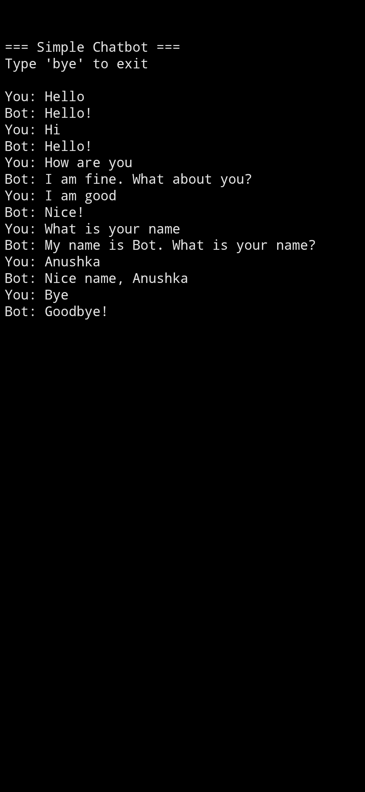

# chatbot-
Python based chatbot project with simple conversational responses and user interaction.

# Python Chatbot

This is a simple chatbot project developed using Python.

## Features
- Responds to greetings like Hi and Hello
- Basic conversation replies
- Asks user name
- Friendly interaction
- Beginner friendly project

## Technologies Used
- Python

## How to Run
1. Open the Python file
2. Run the program
3. Start chatting with the bot

## Sample Conversation
User: Hi  
Bot: Hello!

User: How are you?  
Bot: I am fine, what about you?

User: Fine  
Bot: Nice

User: What is your name? 

Bot: My name is bot. What is your name?

## Author
Anushka Singh

#screenshot

